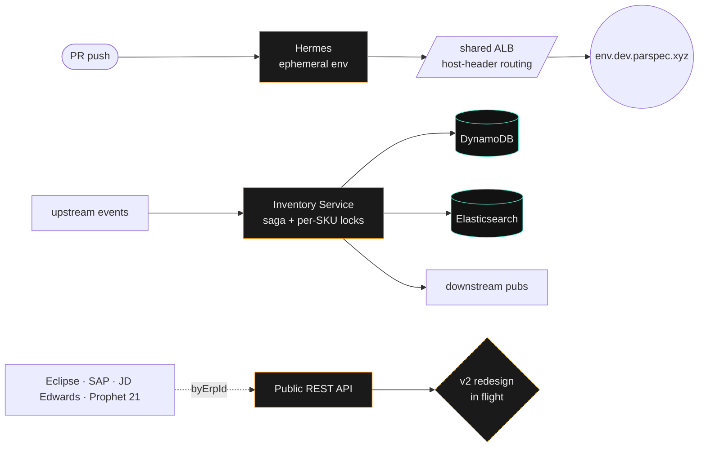

<!-- ──────────────────────────────────────────────────────────────────── -->

<div align="center">

<samp>WORK · ACCOUNT</samp>

# पारितोष त्रिपाठी

*Backend &middot; distributed systems &middot; occasional reverse engineering*

</div>

<!-- ──────────────────────────────────────────────────────────────────── -->

> [!NOTE]
> This is my **work account** at [Parspec](https://parspec.io).
> For personal projects, side experiments, and open source &rarr;
> **[@paritoshtripathi935](https://github.com/paritoshtripathi935)**

<br />

```ts
const paritosh = {
  role:        "Software Engineer II",
  company:     "@parspec",
  since:       "2025-04",
  location:    "Bangalore · IN",
  stack:       ["Python", "Go", "Java", "TypeScript"],
  cloud:       ["AWS · ECS · SQS · S3 · EventBridge", "Aurora · DynamoDB"],
  databases:   ["PostgreSQL", "MongoDB", "OpenSearch", "Elasticsearch", "Redis"],
  currently:   "v2 REST API redesign · centralised cron infra",
  previously:  "founding-team SE I · Anakin (YC S21)",
  obsessions:  ["sub-100ms p99", "saga + per-aggregate locks", "config-as-data"],
} as const;
```

<br />

## what i ship at @parspec



<br />

## now playing

| | what | where |
| --- | --- | --- |
| **🟠** | Hermes &mdash; per-branch ephemeral envs &middot; 1,567 builds &middot; 88% e2e | [/work/hermes](https://paritoshdev.netlify.app/work/hermes) |
| **🟢** | Inventory Service &mdash; saga + per-SKU locks &middot; 3.9M+ writes | [/work/inventory-service](https://paritoshdev.netlify.app/work/inventory-service) |
| **🟣** | Product Finder &mdash; soft-filter search + ML image similarity &middot; +21% accuracy | [/work/product-finder](https://paritoshdev.netlify.app/work/product-finder) |
| **🔵** | Generic Compiler Service &mdash; config-driven pipeline · 200 GB/day peak | [/work/generic-compiler](https://paritoshdev.netlify.app/work/generic-compiler) |

→ full deep-dives on **[paritoshdev.netlify.app](https://paritoshdev.netlify.app)**

<br />

## elsewhere

```bash
$ whois paritosh
─────────────────────────────────────────────────────────────
  portfolio    https://paritoshdev.netlify.app
  linkedin     https://www.linkedin.com/in/a-paritoshtripathi
  personal     https://github.com/paritoshtripathi935
  email        paritosh.tripathi.work@gmail.com
─────────────────────────────────────────────────────────────
```

<br />

<!-- ──────────────────────────────────────────────────────────────────── -->

<div align="center">

<sub>Repositories under this account are work-related.<br />
For everything else &rarr; <a href="https://github.com/paritoshtripathi935"><b>@paritoshtripathi935</b></a></sub>

</div>

<!-- ──────────────────────────────────────────────────────────────────── -->
